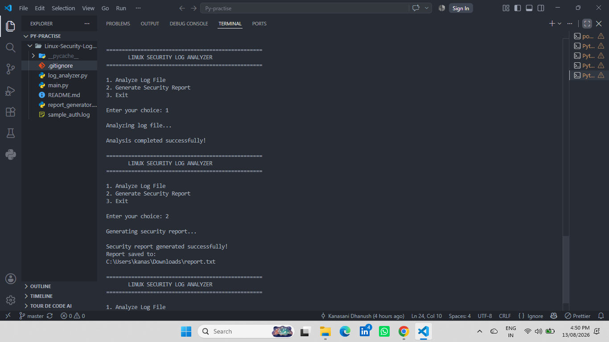
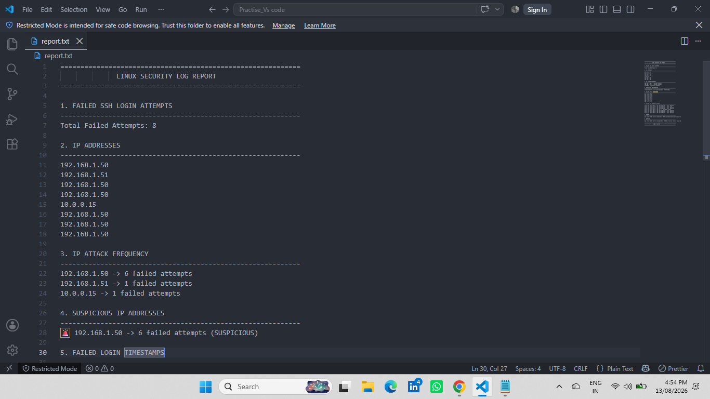
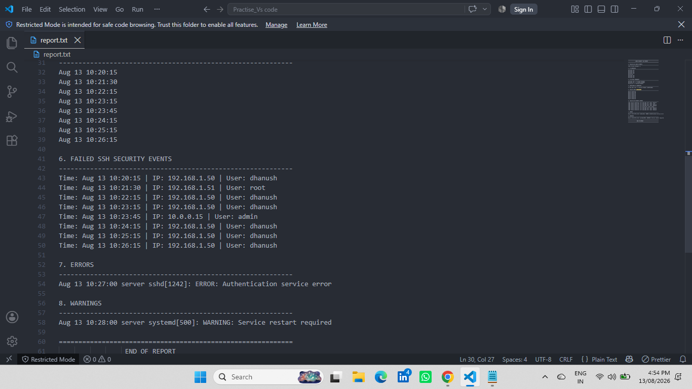

# Linux Security Log Analyzer

A Python-based security log analysis tool that analyzes Linux authentication logs, detects suspicious SSH login activity, and generates a structured security report.

## Features

- Detects failed SSH login attempts
- Extracts login timestamps
- Extracts source IP addresses
- Counts failed login attempts by IP address
- Identifies suspicious IP addresses
- Extracts attempted usernames
- Creates detailed SSH security events
- Detects errors and warnings
- Generates a structured security report
- Supports command-line log file input
- Uses modular Python components

## Technologies Used

- Python 3
- Regular Expressions (`re`)
- Argparse
- File Handling
- Lists and Dictionaries
- Functions
- Modular Python Programming

## Project Structure

```text
Linux-Security-Log-Analyzer/
│
├── main.py
├── log_analyzer.py
├── report_generator.py
├── sample_auth.log
├── Linux-Security-Log-Analyzer.pptx
├── screenshots/
├── .gitignore
└── README.md
```

## How It Works

The application processes a Linux authentication log and generates a security report.

```text
Linux Authentication Log
          │
          ▼
     Log Analyzer
          │
          ▼
   Security Analysis
          │
          ▼
  Report Generator
          │
          ▼
    Security Report
```

### 1. Log Analysis

`log_analyzer.py` reads the authentication log and extracts:

- Failed login attempts
- IP addresses
- Usernames
- Timestamps
- SSH security events
- Errors
- Warnings

### 2. Security Analysis

The analyzer counts failed login attempts for each IP address.

By default, an IP address with **5 or more failed attempts** is classified as suspicious.

### 3. Report Generation

`report_generator.py` creates a structured security report containing:

- Total failed SSH attempts
- IP addresses
- IP attack frequency
- Suspicious IP addresses
- Failed-login timestamps
- SSH security events
- Errors
- Warnings

## How to Run

### 1. Clone the Repository

```bash
git clone https://github.com/kanasanidhanush7-dev/Linux-Security-Log-Analyzer.git
```

### 2. Enter the Project Directory

```bash
cd Linux-Security-Log-Analyzer
```

### 3. Run the Analyzer

The repository includes a sample authentication log for testing.

```bash
python main.py --log "sample_auth.log"
```

### 4. Use the Menu

```text
==================================================
       LINUX SECURITY LOG ANALYZER
==================================================

1. Analyze Log File
2. Generate Security Report
3. Exit
```

Select:

```text
1
```

to analyze the log file.

Then select:

```text
2
```

to generate the security report.

## Example Analysis

```text
1. FAILED SSH LOGIN ATTEMPTS

Total Failed Attempts: 8

2. IP ATTACK FREQUENCY

192.168.1.50 → 6 failed attempts
192.168.1.51 → 1 failed attempt
10.0.0.15 → 1 failed attempt

3. SUSPICIOUS IP ADDRESSES

🚨 192.168.1.50 → 6 failed attempts (SUSPICIOUS)
```

## Screenshots

### Analyzer Execution



### Security Report Summary



### Security Report Details



## Purpose

This project was developed as a practical Python and Linux security project to demonstrate:

- Linux authentication log analysis
- Basic security monitoring
- Failed SSH login detection
- IP-based security analysis
- Regular expression processing
- File handling
- Data extraction
- Security-event detection
- Modular Python programming
- Command-line application development

## Future Improvements

Planned improvements include:

- Real-time log monitoring
- Support for additional Linux log formats
- CSV and JSON report generation
- Email alerts for suspicious activity
- IP geolocation
- Graphical security statistics
- Additional command-line options
- Detection of more Linux security events

## Author

**K. Venkata Dhanush**

GitHub:  
https://github.com/kanasanidhanush7-dev

## Project Usage

This project is intended for educational and portfolio purposes.
